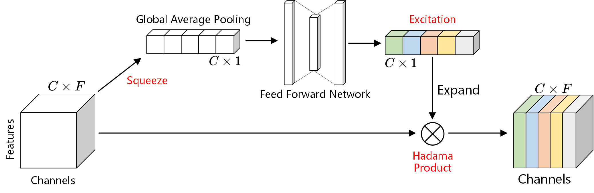
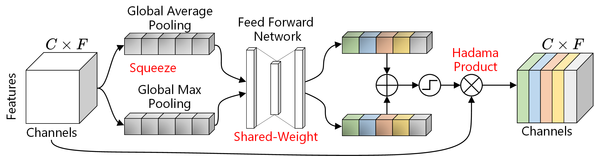
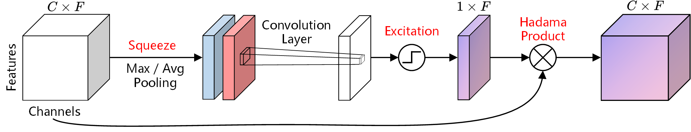

# Channel-Attention 

A plug-and-play channel attention mechanism module implemented in PyTorch.

<div align="center">

[Installation](#Installation) | [Usage](#Usage) | [Modules](#Modules) | [Blog](https://mp.weixin.qq.com/s/D6O5SBl2RYHdkiinV6UM8w) | [Experiments](#Experiments)
</div>

<div align="center">

[](https://pypi.org/project/s2generator/)   [](https://pytorch.org/) [](https://pepy.tech/project/s2generator) [](https://github.com/psf/black)

</div>


## Installation <a id="Installation"></a>

You can install the package via pip:

```bash
pip install channel-attention
```

We only develop and test with PyTorch. Please make sure to install it from [PyTorch official website](https://pytorch.org/get-started/locally/) based on your system configuration.

## Usage <a id="Usage"></a>


## Modules <a id="Modules"></a>

#### 1. [`SEAttention`](https://github.com/wwhenxuan/Channel-Attention/blob/main/channel_attention/squeeze_excitation.py): [[paper]]() The Squeeze-and-Excitation Attention with Global Average Pooling and Feed Forward Network.

<div style="text-align: center;">
    
</div>

#### 2. [`ChannelAttention`](https://github.com/wwhenxuan/Channel-Attention/blob/main/channel_attention/channel_attention.py): [[paper]]() The Channel Attention with Global Average Pooling and Global Max Pooling.

<div style="text-align: center;">
    
</div>

#### 3. [`SpatialAttention`](https://github.com/wwhenxuan/Channel-Attention/blob/main/channel_attention/spatial_attention.py): [[paper]]() The Spatial Attention with Global Average Pooling and Global Max Pooling.

<div style="text-align: center;">
    
</div>


## Experiments <a id="Experiments"></a>